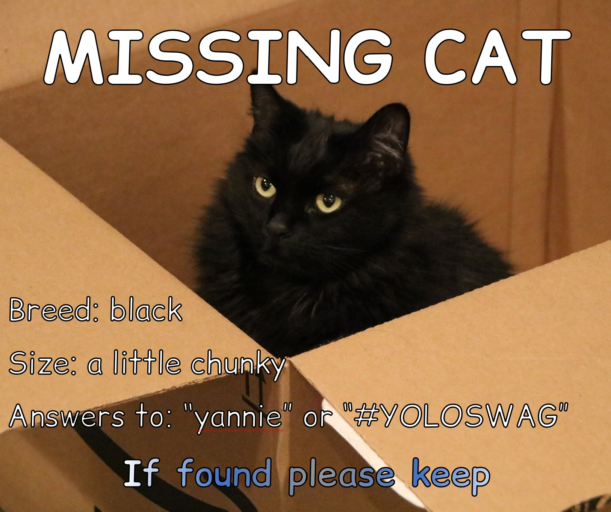

# Comic Relief

[![][Fontbakery]](https://loudifier.github.io/Comic-Relief/fontbakery/fontbakery-report.html)
[![][Universal]](https://loudifier.github.io/Comic-Relief/fontbakery/fontbakery-report.html)
[![][GF Profile]](https://loudifier.github.io/Comic-Relief/fontbakery/fontbakery-report.html)
[![][Outline Correctness]](https://loudifier.github.io/Comic-Relief/fontbakery/fontbakery-report.html)
[![][Shaping]](https://loudifier.github.io/Comic-Relief/fontbakery/fontbakery-report.html)

[Fontbakery]: https://img.shields.io/endpoint?url=https%3A%2F%2Fraw.githubusercontent.com%2Floudifier%2FComic-Relief%2Fgh-pages%2Fbadges%2Foverall.json
[GF Profile]: https://img.shields.io/endpoint?url=https%3A%2F%2Fraw.githubusercontent.com%2Floudifier%2FComic-Relief%2Fgh-pages%2Fbadges%2FGoogleFonts.json
[Outline Correctness]: https://img.shields.io/endpoint?url=https%3A%2F%2Fraw.githubusercontent.com%2Floudifier%2FComic-Relief%2Fgh-pages%2Fbadges%2FOutlineCorrectnessChecks.json
[Shaping]: https://img.shields.io/endpoint?url=https%3A%2F%2Fraw.githubusercontent.com%2Floudifier%2FComic-Relief%2Fgh-pages%2Fbadges%2FShapingChecks.json
[Universal]: https://img.shields.io/endpoint?url=https%3A%2F%2Fraw.githubusercontent.com%2Floudifier%2FComic-Relief%2Fgh-pages%2Fbadges%2FUniversal.json

Comic Relief is a typeface designed to be metrically equivalent to the popular Comic Sans MS. Comic Relief can be used in place of Comic Sans MS without having to move, resize, or reset any part of the copy. Perfect for missing cat posters and all of your WordArt needs!

Comic Relief is copylefted using the SIL Open Font License, so feel free to use it, modify it, or embed it as you see fit. It is available here on GitHub and is in the process of being added to Google Fonts.

## Features and development

Comic Relief includes every glyph in Comic Sans MS Regular and Bold, as it existed in standard copies of Windows 7 and earlier. An italic variant of Comic Sans MS was introduced in Windows 8, but *Comic Relief does not have a metrically-equivalent italic variant*. An italic variant is the next major feature... eventually.

Similarly, there is a "Pro" version of Comic Sans that includes additional glyphs, swashes, ligatures, etc. Comic Relief is not a metrically equivalent replacement for Comic Sans Pro, but some sort of "Comic Relief Preaux" typeface is on the list of someday-when-I-have-more-time projects.

Comic Relief is in maintenance mode. Bugfixes to the Regular and Bold weights will be prioritized, but there is no timeline for italic or Preaux variants. Please file a bug if you find an issue or would like to see something tweaked. Contributions are very welcome, especially if you want to tackle italic or Preaux.

## Building

Fonts are built automatically by GitHub Actions - take a look in the "Actions" tab for the latest build.

If you want to build fonts manually on your own computer:

* `make build` will produce font files.
* `make test` will run [FontBakery](https://github.com/googlefonts/fontbakery)'s quality assurance tests.
* `make proof` will generate HTML proof files.

The proof files and QA tests are also available automatically via GitHub Actions - look at https://loudifier.github.io/Comic-Relief.

## Changelog

**17 JAN 2013, v1.0**
- Initial release. Contains all glyphs necessary to replace Comic Sans MS Regular V5.0

*Note: This is the version on FontSquirrel since 2013, and probably the most widely used version of Comic Relief. I tried asking them to update to v1.1, but never received a response. If somebody at FontSquirrel reads this, please update to the latest version.*

**19 NOV 2013, v1.1**
- Bold Variant added
- Highest/lowest points adjusted for better compatibility with Comic Sans MS
- Crossbar of lowercase 't' raised slightly

**15 JUL 2013, v1.1.1 (initial version added to GitHub)**
- Changed OS/2 Win Descent from -42 to 0 to get sources to compile with gftools

## License

This Font Software is licensed under the SIL Open Font License, Version 1.1.
This license is available with a FAQ at
https://scripts.sil.org/OFL

## Repository Layout

This font repository structure is inspired by [Unified Font Repository v0.3](https://github.com/unified-font-repository/Unified-Font-Repository), modified for the Google Fonts workflow.
